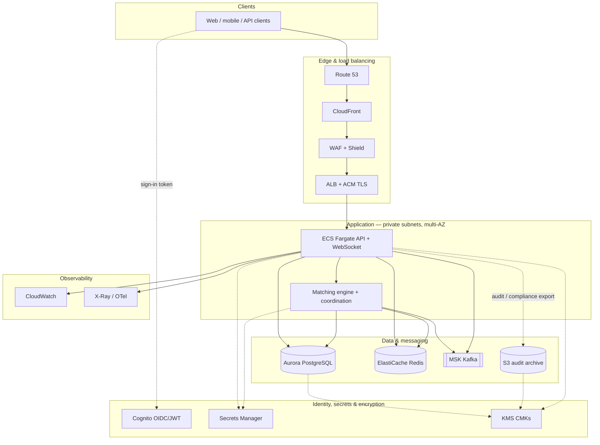
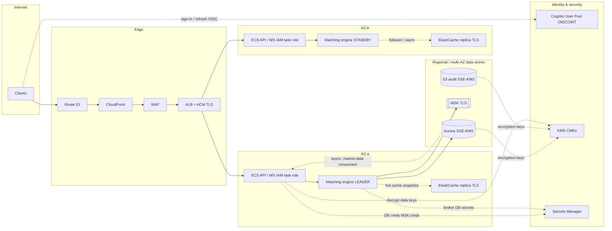
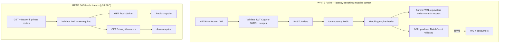
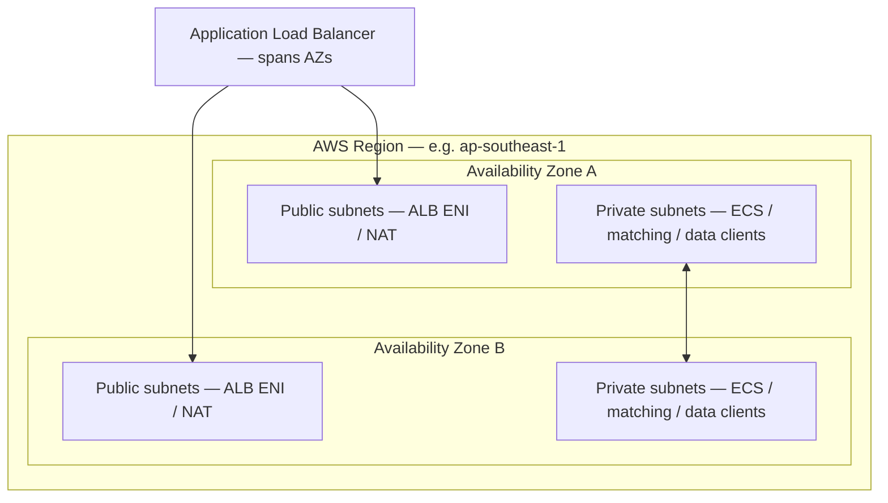

# Problem 2 – Highly Available Trading System Architecture

Design of a resilient, scalable, cost-effective trading platform inspired by core Binance-style features, with emphasis on availability, **correctness**, and scalability.

---

## 0. Constraints (as specified)

| Constraint | Value |
|------------|--------|
| **Cloud provider** | **Amazon Web Services (AWS)** only |
| **Throughput** | **500 requests per second** (aggregate API traffic) |
| **Latency** | **p99 response time < 100 ms** (API path, region-local clients) |

Non-functional paths (e.g. async analytics, batch exports) are excluded from the 100 ms p99 unless stated. **Order submission / matching** has stricter **business** SLOs documented in §8.

---

## 1. Features in Scope

- **Order management** – Place/cancel orders (limit, market), order book
- **Matching engine** – Central order matching with **defined consistency** and **immutable audit**
- **Market data** – Real-time ticker, depth, and trades via WebSocket
- **Account & balances** – Wallet balances, position tracking (simplified)
- **REST + WebSocket APIs** – Public (market data) and private (orders, account) with auth

Out of scope: full custody, fiat rails, complex margin/derivatives, KYC pipelines.

---

## 2. Architecture overview — diagrams and planes

The deliverable asks for an **overview of services and roles**. Start with the **architecture overview** (§2.1), then **control vs data plane** (§2.2), **Multi-AZ** detail (§2.3), **read/write paths** (§2.4), and the **service role** table (§2.5).

### 2.1 Architecture overview diagram

Single **regional** view: how **users**, **edge**, **identity & secrets**, **application**, **data**, and **observability** connect. (VPC boundaries, per-AZ placement, and security dashed lines are expanded in §2.3.)

**How to read this diagram**

| Layer | Responsibility |
|-------|------------------|
| **Edge** | DNS, **TLS** termination (**ACM**), **WAF** / **Shield**, traffic distribution to **compute**. |
| **Identity** | **Cognito** issues **JWTs**; **Secrets Manager** holds **DB/MSK** credentials for **IAM**-scoped tasks; **KMS** keys **encrypt** Aurora, S3, and sensitive fields. |
| **Application** | **Stateless** **ECS** tier + **stateful matching** tier (see **§3** for consistency). |
| **Data** | **System of record** (**Aurora**), **cache** (**Redis**), **event bus** (**MSK**), **long-term audit** (**S3**). |
| **Observability** | **Metrics/alarms** and **distributed traces** — full order path in **§8**. |

### 2.2 Control plane vs data plane

| Plane | Responsibility | Typical AWS components |
|-------|----------------|-------------------------|
| **Control plane** | **Configuration and lifecycle**: deploys, autoscaling policies, secrets rotation, feature flags, **matching-engine leader election config** (not the hot path per order). | **ECS/EKS control plane**, **Systems Manager Parameter Store**, **Secrets Manager**, **CodePipeline/CodeDeploy**, optional **etcd** (if self-managed consensus). |
| **Data plane** | **Per-request / per-event** work: HTTP/WebSocket, **matching**, **persistence**, **market-data fan-out**. Everything that touches customer money or orders in real time. | **ALB**, **ECS tasks**, **matching-engine processes**, **Aurora**, **ElastiCache**, **MSK**, **X-Ray** |

**Rule:** Trading correctness and latency SLOs apply to the **data plane**. Control-plane outages may block deploys but must not silently corrupt order state.

### 2.3 Diagram A — Multi-AZ data plane (VPC, synchronous vs asynchronous hints)

**Legend (not all edges are HTTP):**

- **Solid user path:** Client → edge → **ECS** → **matching leader** → **Aurora** (durable commit) and **MSK** (async publish — see §2.4). **Private APIs** carry **Bearer JWT** issued by **Cognito**; **ECS** validates via **JWKS** (§5).
- **Dashed — security / support:** **Cognito** = login/token **out of band** of the main request line; **Secrets Manager** = runtime creds for tasks; **KMS** = **SSE-KMS** for Aurora/S3 and **data-key** use; **dashed** cache/async unchanged below.
- **Dashed — data:** Cache replicas; async fan-out. **ElastiCache** holds **working set / snapshots**, not the **source of truth** for recovery (§3).

### 2.4 Diagram B — Write path vs read path

| Path | Purpose | Synchronous steps (typical) | Async (does not block HTTP ack for ack-eligible APIs) |
|------|-----------|------------------------------|--------------------------------------------------------|
| **Write** | Submit / cancel order, **match** | ALB → ECS → **JWT validate (Cognito JWKS) + scopes** → **idempotency check (Redis)** → **matching engine** → **append audit + order state to Aurora** → **publish match event to MSK** | Downstream: WebSocket consumers, analytics, **MSK** replication |
| **Read** | Balances, public book, history | ALB → ECS → **JWT** for **private** routes → **Redis** (ticker, cached book) or **Aurora replica** (history) | — |

**MSK publish:** For **HTTP 200** semantics, the design **commits durable state in Aurora first**, then produces to MSK (or uses **outbox pattern** so MSK failure does not lose events — see §3). **p99 < 100 ms** assumes the **synchronous** segment stays within budget (§6).

### 2.5 Diagram C — Where each service sits (role summary)

| Service | Role in one line |
|---------|------------------|
| **Route 53 / CloudFront / WAF / ALB** | DNS, edge cache, L7 security, **ACM TLS**, route to ECS. |
| **Cognito User Pool** | **OIDC / JWT** for users; ECS validates **Bearer** tokens (**JWKS**). |
| **KMS / Secrets Manager** | **SSE-KMS** for Aurora & S3; **Secrets Manager** for DB/MSK creds to tasks (**IAM**-scoped). |
| **IAM** | **Task roles** for ECS/EC2 — **least privilege** to AWS APIs (**no** static keys in images). |
| **ECS Fargate** | Stateless API + WebSocket **front**; **JWT validation**; no order book truth. |
| **Matching engine (EC2 or ECS)** | **Single-writer** per symbol shard; **leader** + **standby**; **Raft/etcd** or external coordination (§3). |
| **Aurora PostgreSQL** | **System of record**: orders, balances (or reservations), **append-only audit** tables, **outbox** for MSK. |
| **ElastiCache Redis** | Idempotency keys, **balance reservations**, **hot book snapshot**, rate limits — **not** durable recovery source. |
| **MSK (Kafka)** | **Sequenced** market-data and trade events; replay and gap detection. |
| **S3** | Long-retention **immutable** audit exports, compliance. |
| **X-Ray + CloudWatch** | **Distributed trace** of write path; metrics; **business SLO** dashboards (§8). |

---

## 3. Matching engine — consistency, persistence, and failover

This is the **core** of the system; web-tier HA is insufficient without a precise **matching** model.

### 3.1 Consistency model and the “at-most-once fill” problem

**Requirement:** A match (fill) must be **at-most-once** from the client’s perspective: **never double-execute** the same fill; **never lose** an accepted order without explicit **rejection** or **durably recorded** state so the client can reconcile.

| Scenario | Desired behavior |
|----------|------------------|
| Leader **accepts** an order in memory, **crashes** before **durable commit** | Client may **retry with same idempotency key** (§4); engine **must not** double-match. **Recovery:** uncommitted in-memory state is **lost**; client sees **timeout** and retries — idempotency dedupes **submission**, **matching** replays from **durable intent** in Aurora. |
| Leader **commits** match to Aurora, **crashes** before MSK publish | **Outbox pattern:** row in `outbox` table in **same transaction** as match; **relay** publishes to MSK; no lost fills. |
| Network **partition** between AZs | See **split-brain** (§7.3). |

**Implementation sketch:**

1. **Order intent** is **inserted** into Aurora (`orders` with status `PENDING`) in a **transaction** **before** the in-memory book is updated (or in the same critical section with **two-phase** semantics).
2. **Matching** updates **same transaction**: `orders` → `FILLED`, `fills` insert, **balances / reservations** updated.
3. **Commit** to Aurora = **durable** decision; only then is the match **irreversible** for billing.

**Redis is not the durability boundary.** If Redis dies, **replay** from Aurora + **rebuild** in-memory book from **event log** or **snapshot + delta** (§3.2).

### 3.2 How the order book is persisted

| Layer | What it stores | Durability |
|-------|----------------|------------|
| **Aurora (primary)** | **Append-only** `order_events` (or equivalent), **current order state**, **fills**, **balance reservations**, **outbox rows** | **Durable**; Multi-AZ sync per Aurora config |
| **Optional: MSK as immutable log** | **Match events** for **external** consumers; **not** required for engine recovery if Aurora is source of truth | Replicated |
| **ElastiCache** | **Hot order book** snapshot, **ranked queues** per symbol for speed | **Ephemeral**; rebuilt after failover |

**Recovery path if Redis fails before DB write completes:**

- **Invariant:** No fill is **acknowledged to the client** until **Aurora commit** succeeds. If the process dies **after** commit but **before** Redis update, **new leader** loads state from Aurora and **rehydrates** Redis from **DB + optional event replay**.
- If the process dies **before** commit, the **order** may be `PENDING` or absent — client **idempotency retry** converges.

**WAL terminology:** Aurora’s **storage layer** provides **redo**; **application-level** “WAL” is the **append-only order_events + outbox** in PostgreSQL (or **Kinesis** as **ingest** in larger systems — here Aurora suffices at 500 RPS).

### 3.3 Leader, standby, and concrete consensus

**Options (AWS-grounded):**

| Approach | How it works | Operational reality |
|----------|--------------|---------------------|
| **Dedicated EC2 + embedded Raft** (e.g. **Hashicorp Raft** / **etcd** as separate cluster) | **3+ nodes** for quorum; **leader** runs matcher | **etcd is not a managed AWS service**; typical patterns: **self-managed etcd on EC2** (3-node ASG across AZs), or **EKS** (Kubernetes uses etcd for the control plane — you don’t run application Raft inside it unless you deploy **etcd as workloads**). For matching-only, **small EC2 cluster + etcd** is the clearest **ops** story. |
| **ECS + external lock** | **Single writer** via **DynamoDB conditional writes** / **RDS advisory locks** | Simpler but **lock TTL** and **fencing** must be bulletproof — often **weaker** than Raft for **hard** partition tolerance |
| **Single active + Aurora row lease** | **Leader lease** with **expiry** and **fencing token** in DB | Works at moderate scale; **must** fence stale leaders |

**Recommendation for this design:** **Matching engine on EC2 (or ECS with stable ENIs)** in **3-node** group across AZs, using **etcd** (self-managed on EC2 or **EKS** if you already run K8s) **or** **AWS-managed alternative**: run **only** the coordination on **small EC2 ASG** with **etcd**, **not** “Raft in a sentence.”

**Raft named =** typically **etcd** (Go Raft implementation) **or** Consul; **document which** and **how many** nodes, **which AZs**.

### 3.4 Failover RTO / RPO

| Metric | Target (example — tune per product) | Notes |
|--------|-------------------------------------|--------|
| **RPO** | **~0** for committed matches (Aurora sync) | Uncommitted in-flight may be **lost** from client POV → **idempotency** |
| **RTO** | **Seconds to low tens of seconds** | **Leader election** (etcd) + **standby** catch-up + **resume** ingestion; **not** instant — **document** e.g. **15–45 s** worst case so stakeholders know **trading may halt** that window |
| **During RTO** | **Reject or queue** new orders at API | **503** with `Retry-After` or **read-only** flag (§7.4) |

**30 seconds of halted matching** is a **P0** for a live exchange; mitigation = **symbol sharding** (only **affected** symbols down), **multi-region** (out of scope for minimal design), **transparent** status page + **runbook**.

---

## 4. Financial-domain correctness

Requirements that **generic** web stacks often omit.

### 4.1 Idempotency keys (order submission)

- Clients send **`Idempotency-Key`** (or body field) on **POST /orders**.
- **Redis**: `SET key UUID NX EX 86400` (or store hash of request) — **duplicate** returns **same** `order_id` / **409** with prior response body cached **if** required.
- **Prevents:** duplicate orders on **client retry after timeout**.

### 4.2 Immutable audit trail (separate concern from “app DB”)

- **Every** state transition: `PENDING` → `PARTIAL` → `FILLED` / `CANCELLED` appended to **`order_events`** (append-only table) **in the same transaction** as state change **before** HTTP response (or via **strict** ordering).
- **Regulatory / forensic:** periodic **export to S3** (immutable bucket, **Object Lock** optional), **separate** from **operational** queries on `orders` main table.
- **Not** “same as application DB” — **append-only** stream is the **legal** timeline; **current row** is a **projection**.

### 4.3 Sequence numbers and market-data integrity

- Each **symbol** has a monotonic **`sequence_id`** (or **Kafka offset + partition**) on **every** book update / trade published to **MSK**.
- **Consumers** (WebSocket fan-out, external feeds) **detect gaps** → **request snapshot** via **REST** `GET /book?symbol=X&after_seq=N` and **resync**.
- **MSK** partition key = **symbol** to preserve **per-symbol** ordering.

### 4.4 Balance locking and oversell prevention

- **Never** “read balance then write later” without **locking** or **reservation**.
- **Models:**
  - **Pessimistic:** `SELECT … FOR UPDATE` on **balance row** in Aurora in same txn as **reservation insert**.
  - **Reservation:** decrement **available**, increment **reserved** atomically; **match** moves **reserved** → **filled**.
- **Concurrent orders** from one account: **serialized** per **account_id** (shard lock) or **DB constraint** so **sum(reservations) ≤ balance**.

---

## 5. AWS services, rationale, and alternatives *within AWS*

**Clarification vs earlier sketches:** **ElastiCache** is **not** the durable order-book store — it holds **hot snapshots**, **idempotency keys**, and **reservations**; **Aurora** (+ append-only events / outbox) is the **source of truth** (§3.2).

### Edge and networking

| AWS service | Role | Why this service | Other AWS options considered |
|-------------|------|------------------|------------------------------|
| **Route 53** | Public DNS (ALIAS to CloudFront/ALB); optional private hosted zones | Latency-based / weighted / failover routing | Registrar DNS only (weaker AWS integration) |
| **CloudFront** | Static assets; optional cache for idempotent GETs | Edge TLS, offload | ALB-only |
| **AWS WAF + Shield** | L7 rules, rate limits, DDoS | Native on ALB/CloudFront | NACLs/SGs only (no L7) |
| **ALB** | TLS, HTTP/WebSocket routing, **sticky sessions** for WS (best-effort) | Health checks, cross-zone | NLB if raw TCP only |

### VPC and internal traffic

| AWS service | Role | Why | Other AWS options |
|-------------|------|-----|-------------------|
| **VPC, subnets** | Public (ALB, NAT); private (ECS, RDS, Redis, MSK) | Blast-radius | Default VPC (non-prod) |
| **IGW / NAT / VPC endpoints** | Inbound path; outbound; private AWS API access | Cost + security | NAT instance (legacy) |
| **Security groups** | Least-privilege east–west | Stateful | NACLs optional |

### Compute

| AWS service | Role | Why | Other AWS options |
|-------------|------|-----|-------------------|
| **ECS Fargate** | Stateless API + WebSocket | Ops simplicity, multi-AZ | EKS, EC2 ASG |
| **EC2 (e.g. `c7i`) + ASG** | **Matching engine** + optional **etcd** nodes | Predictable CPU, placement groups for latency | Fargate for matching if variance acceptable |

### Data and messaging

| AWS service | Role | Why | Other AWS options |
|-------------|------|-----|-------------------|
| **Aurora PostgreSQL** | Orders, balances, **order_events**, **outbox** | Durable, failover, replicas | DynamoDB for specialized KV |
| **RDS Proxy** | Pooling, failover handling | Tail latency | Direct connect without proxy |
| **ElastiCache Redis** | Idempotency, reservations, **hot book** (non-durable) | Sub-ms | DAX if DynamoDB |
| **MSK (Kafka)** | Sequenced match/book events; consumer lag metrics | Ordering + replay | Kinesis, SQS (different semantics) |
| **S3 + Object Lock** | Long-term **audit** exports | Compliance, cheap | — |

### Observability and incident response

| AWS service | Role | Why | Other AWS options |
|-------------|------|-----|-------------------|
| **CloudWatch** | Metrics, **alarms → SNS** | Native | — |
| **X-Ray** or **ADOT** | **Distributed traces** (§8) | p99 root cause | Self-hosted Jaeger |
| **SNS** | Fan-out to **PagerDuty** / email / Lambda | Escalation | EventBridge for complex routing |

### Security and identity

Trading systems require **defense in depth**: network isolation (§5 VPC), **strong identity** for humans and software, **encryption**, and **auditable** access to data and control planes.

#### Identity and access management (IAM)

| Layer | Pattern | AWS services / notes |
|-------|---------|----------------------|
| **Workloads → AWS APIs** | **Least privilege** IAM **roles** attached to **ECS task roles** (Fargate) and **EC2 instance profiles** (matching engine, etcd) — **no long-lived access keys** in containers | **IAM**, **STS** for temporary creds; **scoped** policies: e.g. `s3:PutObject` only on `arn:…/audit/*`, `kms:Decrypt` only for specific CMKs |
| **Humans / operators** | **No shared root**; **SSO** to **roles** with **short sessions** | **IAM Identity Center** (SSO) → **permission sets** → **roles** in accounts; **break-glass** emergency role **MFA**-gated and **CloudTrail**-alerted |
| **CI/CD and IaC** | **OIDC** from GitHub Actions / CodePipeline to **assume role** — no static keys in repos | **IAM OIDC identity provider** |
| **Cross-account** (if used) | **Resource policies** + **role assumption** with **external ID** | Document **trust** boundaries |

#### Client-facing identity (API consumers)

| Concern | Approach | Notes |
|---------|----------|--------|
| **End users (web/mobile)** | **Amazon Cognito** (User Pools) — **OAuth 2.0 / OIDC**; **JWT access tokens** validated by **ECS** (JWKS) | **Scopes** map to **trading** actions (e.g. `orders:write`, `account:read`); **short-lived** tokens + **refresh** rotation |
| **Machine / API clients** | **API keys** in **Secrets Manager** or **Cognito** app clients + **client credentials**; **rate limits** at **WAF** + **application** | **Never** log raw secrets; **hash** or **reference by ID** in audit |
| **Public market data** | **Unauthenticated** or **optional** API key tier | **Separate** paths from **private** order APIs — **WAF** rules per route |

**Authorization:** Enforce **account_id** (or `sub` from token) **matches** resource being traded — **server-side** only; **no** trust of client-supplied account without **cryptographic** binding to identity.

#### Secrets and key management

| Secret type | Store | Practice |
|-------------|-------|----------|
| **DB passwords, MSK SASL, third-party API keys** | **AWS Secrets Manager** — **rotation** where supported | ECS tasks **inject** at runtime via **task definition** secrets; **RDS Proxy** can use **Secrets Manager** integration |
| **Non-secret config** (feature flags, `TRADING_HALTED`) | **Systems Manager Parameter Store** (**Hierarchical** + **SecureString** with **KMS**) | **IAM** restricts **who** can flip trading halt flags (§7.4) |
| **TLS private keys (if not using ACM)** | **Secrets Manager** or **ACM**-managed certs on **ALB** | Prefer **ACM** for **ALB** public certs |

#### Encryption

| Data state | Mechanism |
|------------|-----------|
| **In transit (Internet → ALB)** | **TLS 1.2+**; **modern cipher** policy on **ALB** / **CloudFront**; **HSTS** at edge where applicable |
| **In transit (inside VPC)** | **TLS** to **RDS Proxy** / **Aurora**; **ElastiCache** **in-transit encryption**; **MSK** **TLS** between clients and brokers |
| **At rest** | **Aurora** encryption with **AWS KMS** CMK; **S3** **SSE-KMS** (audit exports); **EBS** encrypted volumes for **EC2** matching nodes |
| **Key policy** | **KMS** CMKs with **least-privilege** key policies; **separate** keys for **PII/audit** vs **operational** if compliance requires |

#### Network-level security (summary)

- **Security groups:** ALB → ECS **only** on app ports; ECS → **only** RDS Proxy / Redis / MSK endpoints; **deny** direct Internet to **data** tiers (§5 VPC).
- **NACLs:** Optional **extra** subnet boundaries; **SGs** usually sufficient.
- **PrivateLink / VPC endpoints:** Keep **AWS API** traffic off public Internet (**S3, ECR, Secrets Manager, KMS, CloudWatch**).
- **AWS WAF + Shield:** Already on **edge** (§5); **rate-based** rules for **abuse** and **credential stuffing**.

#### Audit, tamper evidence, and detection

| Need | Implementation |
|------|------------------|
| **Who changed infrastructure** | **AWS CloudTrail** — **organization trail**, **immutable** S3 bucket, **MFA delete** / **Object Lock** on bucket |
| **Data access audit** | **Aurora** **audit** logs to **CloudWatch Logs** / **S3**; **application** **order_events** (§4.2) for **business** timeline |
| **Sensitive data in logs** | **Redact** tokens, **PAN**-like fields; **structured** logging with **field classification** |
| **Threat detection** | **GuardDuty** (optional) for **anomalous** API usage; **VPC Flow Logs** to **S3** for **forensics** (cost vs benefit) |

#### Security in the SDLC

- **Dependency scanning** (CI), **container image** scanning (**ECR**), **IaC** scanning (**Checkov** / **tfsec**).
- **Penetration testing** and **bug bounty** per **program** policy; **AWS** notification for **simulated** events if required.

---

## 6. Throughput, and end-to-end latency budget (p99 < 100 ms)

### 6.1 Throughput: 500 RPS

- **Headroom:** **2–4 Fargate tasks**, **Application Auto Scaling** on `RequestCountPerTarget` or CPU.
- **CloudFront** for cacheable GETs reduces origin RPS.

### 6.2 Latency budget — **validated** claim, not hope

**Scope:** **Read-heavy** synchronous API (e.g. **GET ticker**, **GET shallow book** from Redis) — the **stated** p99 < 100 ms target. **Order submit** that **touches Aurora sync write + match** may be **higher** unless optimized; **separate** business SLO for **ack-to-client** (§8).

| Segment | Budget (typical p50 / **allow for p99 tail**) | Notes |
|---------|-----------------------------------------------|--------|
| **ALB + TLS** | ~0.5–2 ms / **~1–3 ms** | Cross-AZ hop adds **~1 ms** if client not co-located |
| **ECS processing + JSON** | ~2–5 ms / **~5–12 ms** | GC, serialization — **right-size** tasks |
| **Redis round-trip** | ~0.2–1 ms / **~1–3 ms** | Same-AZ |
| **RDS Proxy + Aurora read** | ~1–3 ms / **~5–20 ms** | **Writes** higher: **~10–25 ms** sync commit Multi-AZ typical |
| **MSK** | **0 ms on critical path** if **async** after commit | **Fire-and-forget** from outbox relay — **must not** block HTTP if SLO is read path |

**Example — hot read path (GET, Redis hit):**  
~1 + ~6 + ~2 + ~0 = **~9 ms p50**, **~25–40 ms p99** with tail — **within 100 ms** if no Aurora on path.

**Example — write path (order submit, Aurora commit in request):**  
ALB + ECS + Redis idempotency + **Aurora txn** + **no blocking MSK** ≈ **25–50 ms p50**, **~60–90 ms p99** in a tuned region — **still feasible** for < 100 ms **if** matching is **fast** and **one** round-trip to DB; **leave ~10–40 ms** for **GC, spikes, cold pool**.

**Explicit:** **p99 < 100 ms** as a **platform** constraint should be **scoped** (e.g. **“public read APIs”** vs **“order accept ack”**) — both **budgeted** separately in production.

### 6.3 Validation

- **k6** with **client-side** p99, **X-Ray** waterfall (§8).
- **CloudWatch** ALB `TargetResponseTime` **per target group** — **not** sole source of truth.

---

## 7. High availability — engineered, not only “multi-AZ”

This section defines the **high availability (HA) design** for the trading data plane. The **primary** pattern is **Multi-AZ architecture** within a single **AWS Region**: isolate failure to an **Availability Zone** (AZ) without losing the **region**, while **matching-engine** correctness rules (§3, §7.3) still apply.

### 7.1 High availability design — Multi-AZ architecture

**Goals**

| Goal | What Multi-AZ delivers |
|------|-------------------------|
| **Fault isolation** | Loss of **one** AZ (power, networking, single-AZ service incident) should **not** take down the **entire** trading stack. |
| **Continued ingress** | **ALB** keeps routing to **healthy targets** in surviving AZs (**cross-zone load balancing** enabled). |
| **Data durability** | **Aurora** / **MSK** / **ElastiCache Multi-AZ** replicate or failover **within the region** per service model. |
| **Operational clarity** | Each tier’s **failure domain** is documented (below) so **on-call** knows what **auto-recovers** vs what needs **incident runbooks** or manual steps. |

**VPC layout (conceptual)**

- **One VPC** per **region** (e.g. `ap-southeast-1`), **non-overlapping** private CIDRs.
- **Minimum two AZs** in use: e.g. **`ap-southeast-1a`** and **`ap-southeast-1b`** (use **real AZ IDs** that map to **different** physical locations for your account).
- **Per AZ:** **public subnets** (ALB ENIs, NAT Gateway) + **private subnets** (ECS tasks, matching engine, **ElastiCache**, **MSK** broker ENIs, **Aurora** via managed placement).
- **Route tables:** Public subnets → **Internet Gateway**; private subnets → **NAT Gateway** (per AZ or shared per cost/HA trade-off) + **VPC endpoints** for AWS APIs.

**Multi-AZ placement by component**

| Layer | Multi-AZ pattern | If one AZ is impaired |
|-------|------------------|------------------------|
| **Route 53 / CloudFront / WAF** | **Regional** edge services; not AZ-scoped | Rare full-edge outages; **failover** to another region is a **separate** DR design (§9). |
| **ALB** | **Multi-AZ** by default; targets registered **per AZ** | **Unhealthy targets** in bad AZ **removed**; traffic flows to **other** AZs (**cross-zone** ON). |
| **ECS Fargate / EC2 workers** | **Tasks/instances** spread across **≥2 AZs** (capacity providers / ASG **AZ rebalancing**) | **Scheduler** replaces tasks; **min healthy %** on deploy avoids **total drain**. |
| **Matching engine + etcd** | **Leader + followers** across **AZs** (§3.3); **quorum** survives **one** AZ loss if **3+ nodes** | **Election** or **read-only** until quorum (**§7.3**); **RTO** in §3.4. |
| **Aurora PostgreSQL** | **Cluster volume** replicated **across AZs**; **primary** in one AZ, **failover** to replica | **Automatic failover** (typically **~30–120 s** for detection + promotion — **document** for SLOs). |
| **RDS Proxy** | **Multi-AZ** endpoint; **sticky** to **writer** / **reader** routing | **Reconnect** storm mitigation; **failover** handling without **app** hardcoding DB hostname churn. |
| **ElastiCache Redis** | **Multi-AZ with replica**; **automatic failover** of primary | **Brief** unavailability or **read-only** replica promotion; **cache rebuilt** from **Aurora** if needed (§3.2). |
| **MSK (Kafka)** | **Brokers** across **≥3 AZs** (recommended); **replication factor** ≥ 3 | **Partition** **under-replicated** until broker back; **producers** retry (**outbox** preserves **durability** — §3). |

**ALB cross-zone load balancing**

- **Enable** cross-zone on target groups so **clients** are not stuck if their **AZ** has **fewer** healthy targets.
- **Trade-off:** Slightly **higher** cross-AZ **latency** (~1 ms) vs **AZ-local-only** routing — for **500 RPS** and **p99** SLO, cross-zone is usually **acceptable** (§6).

**What Multi-AZ does *not* solve**

| Limitation | Implication |
|------------|-------------|
| **Region-wide** failure | **Multi-AZ** ≠ **multi-region**; **DR** second region + **Route 53** failover / **pilot light** stack (**§9**). |
| **Logical bugs** | **Duplicate fills**, **bad balances** — **correctness** in **§3–4**, not fixed by AZ redundancy. |
| **Split-brain matching** | **Network partition** between AZs — **§7.3**; **fail closed** over **double trading**. |

**Summary checklist (design review)**

- [ ] **≥2 AZs** used for **compute** and **stateful** data (**Aurora**, **MSK**, **ElastiCache** configs reviewed).  
- [ ] **ALB** health checks + **cross-zone** + **connection draining** on deploy.  
- [ ] **Matching** **quorum** layout documented (**3+** nodes across AZs).  
- [ ] **Runbook**: **Aurora failover** + **matching** **no-leader** behavior + **customer messaging** (status page).

### 7.2 WebSocket affinity and failover

| Issue | Mitigation |
|-------|------------|
| **ECS task dies** | **Sticky sessions** help only that task — on death, **connections drop**. |
| **Client behavior** | **Exponential backoff reconnect**; **resume** from **`Last-Event-ID` / sequence** (§4.3). |
| **Missed events during reconnect** | **Gap detection** on sequence → **snapshot resync** REST call. |
| **Grace period** | Document **max silence** before client must **snapshot**; server may send **heartbeat** + **seq**. |

**ALB sticky** is **best-effort**; **stateless WS** design: **subscribe** after reconnect with **from_seq**.

### 7.3 Split-brain and matching engine partition

| Scenario | Policy |
|----------|--------|
| **Leader** loses **quorum** (AZ link flap) | **Step down** — **no** match without **lease** + **fencing**; **reject** orders with **503** rather than **risk double match**. |
| **Standby** thinks it’s leader | **etcd/Raft** prevents **two leaders** with **votes**; **old leader** must **stop** writing (**fenced** via **monotonic token** in Aurora). |
| **Orders during uncertainty** | **Fail closed**: **better** short **unavailability** than **duplicate fills**. |

### 7.4 Read-only mode — concrete mechanics

**Trigger (examples — tune in runbooks):**

| Signal | Threshold (example) | Action |
|--------|----------------------|--------|
| Aurora **primary** unhealthy / **failover** in progress | **CloudWatch** RDS `DatabaseConnections` + **event** `RDS-EVENT` | **API middleware** flips **`TRADING_HALTED=true`** in **Parameter Store** / **feature flag**; **POST /orders** → **503** with JSON body `{ "code": "READ_ONLY" }` |
| Matching engine **no leader** > **N seconds** | **Health check** + **etcd** metrics | Same |
| **Error rate** from matching **> 5%** for **2 min** | **CloudWatch alarm** | **Circuit**: stop **new** orders; **GET** still allowed if **replicas** healthy |

**Implementation:** **Envoy/NGINX** or **app** checks **flag**; **no** vague “circuit breakers” without **numbers**.

---

## 8. Observability — beyond table stakes

### 8.1 Distributed tracing (required for p99 investigations)

- **AWS X-Ray** (or **OpenTelemetry** → **ADOT** → X-Ray/Jaeger) on **full write path**: **ALB segment** → **ECS** → **Redis** → **Aurora** → **outbox relay** → **MSK**.
- **Sampling:** **100%** for **errors**; **1–10%** for success at scale — **always** trace **slow** requests (**tail sampling**).

Without a **single waterfall**, p99 spikes are **guesswork**.

### 8.2 Business-level SLOs and alerts

| SLO (examples) | Measure | Not a default CloudWatch metric |
|----------------|---------|--------------------------------|
| **Order accept latency** | Time from **ingress** to **HTTP 200** with `order_id` | Custom **app timer** + X-Ray |
| **Match-to-WS lag** | `match_commit_time` → **first WS frame** with same `seq` | **MSK consumer lag** + **app** |
| **WebSocket drop rate** | Connections closed / min | **ALB** `ClientTLSNegotiationError` + **app** |
| **Fill correctness** | **Reconciliation** job: **sum(fills) = order_events** | **Batch** + **alarm** on mismatch **> 0** |

### 8.3 Alerting pipeline and escalation

| Component | AWS pattern |
|-----------|-------------|
| **Alarms** | **CloudWatch Alarm** → **SNS topic** `critical-trading` |
| **Paging** | **SNS** → **PagerDuty** / **Opsgenie** integration (or **Lambda** → webhook) |
| **Runbooks** | Link in **alarm description**; **on-call rotation** in PagerDuty |
| **Dashboards** | **CloudWatch dashboard** + **X-Ray** service map **+** business SLO panel |

**Technical-only** “ALB p99” is **insufficient** for **trading** — **composite** pages for **SLO burn rate**.

---

## 9. Scaling when the product grows

- **Horizontal:** ECS for API/WS; **MSK** partitions; **Aurora** read replicas.
- **Matching:** **Vertical** first; then **symbol sharding** with **routing** layer.
- **Global:** DR region, **latency-based** Route 53, **per-region** books (consistency boundaries).

---

## 10. How this design maps to the constraints

| Constraint | How the design satisfies it |
|------------|-----------------------------|
| **AWS only** | **Route 53, CloudFront, WAF, VPC, ALB, ECS, EC2 (matching/etcd), Aurora, RDS Proxy, ElastiCache, MSK, S3, X-Ray, CloudWatch, SNS, Parameter Store** — data plane as in §2–5; **security/identity** as in **§5 (Security and identity)**: **IAM / IAM Identity Center**, **Cognito**, **Secrets Manager**, **KMS**, **ACM**, **CloudTrail**. |
| **500 RPS** | §6.1 — small ECS footprint with headroom. |
| **p99 < 100 ms** | §6.2 **end-to-end budget**; scoped to **read** vs **write** paths; validated with **k6 + X-Ray** (§8). |
| **High availability** | §7.1 **Multi-AZ architecture** (VPC, ALB, ECS, Aurora, MSK, ElastiCache, matching quorum); §7.2–7.4 **session**, **partition**, **degraded** modes. |

**Cost:** Fargate + Aurora Serverless v2 or rightsized RDS; **Savings Plans** when stable.

---

## References in this document

| § | Topic |
|---|--------|
| §2 | **Architecture overview** (§2.1), control/data planes (§2.2), Multi-AZ (§2.3), read/write (§2.4), service table (§2.5) |
| §3 | Matching engine: consistency, persistence, Raft/etcd, RTO |
| §4 | Idempotency, audit, sequencing, balances |
| §5 | AWS services **+ Security and identity** (IAM, Cognito, encryption, audit) |
| §6 | Latency budget |
| §7 | **HA design: Multi-AZ** (§7.1), WebSocket, split-brain, read-only mode |
| §8 | Observability: X-Ray, business SLOs, PagerDuty/SNS |
| §9 | Scaling and multi-region / DR notes |
| §10 | Constraint mapping |