# Problem 2 – Highly Available Trading System Architecture

Design of a resilient, scalable, cost-effective trading platform inspired by core Binance-style features, with emphasis on availability and scalability.

---

## 0. Constraints (as specified)

| Constraint | Value |
|------------|--------|
| **Cloud provider** | **Amazon Web Services (AWS)** only |
| **Throughput** | **500 requests per second** (aggregate API traffic) |
| **Latency** | **p99 response time < 100 ms** (API path, region-local clients) |

The rest of this document is written to satisfy these constraints. Non-functional paths (e.g. async analytics, batch exports) are excluded from the 100 ms p99 unless stated.

---

## 1. Features in Scope

- **Order management** – Place/cancel orders (limit, market), order book
- **Matching engine** – Central order matching with strong consistency and audit trail
- **Market data** – Real-time ticker, depth, and trades via WebSocket
- **Account & balances** – Wallet balances, position tracking (simplified)
- **REST + WebSocket APIs** – Public (market data) and private (orders, account) with auth

Out of scope for this design: full custody, fiat rails, complex margin/derivatives, KYC pipelines.

---

## 2. Overview Diagram

```mermaid
flowchart TB
    subgraph Clients
        Web[Web / Mobile]
        API_Users[API Clients]
    end

    subgraph Global["Route 53 & global edge (outside VPC)"]
        R53[Route 53]
        CDN[CloudFront]
        WAF[AWS WAF + Shield]
    end

    subgraph VPC["VPC — isolated private network (multi-AZ)"]
        subgraph Public["Public subnets"]
            ALB[Application Load Balancer]
            IGW[Internet Gateway]
            NAT[NAT Gateway]
        end
        subgraph Private["Private subnets — internal traffic only"]
            subgraph API["API Tier (Stateless)"]
                REST[REST API Servers]
                WS[WebSocket Servers]
            end
            subgraph Core["Core Trading"]
                ME[Matching Engine Cluster]
                OB[(Order Book Store)]
            end
            subgraph Data["Data & Messaging"]
                MQ[Message Queue]
                Cache[(Distributed Cache)]
                DB[(Primary DB)]
                Replica[(Read Replicas)]
                TS[(Time-Series / Ticks)]
            end
        end
    end

    Web --> R53
    API_Users --> R53
    R53 --> CDN
    R53 --> WAF
    CDN --> ALB
    WAF --> ALB
    ALB --> REST
    ALB --> WS
    REST --> ME
    REST --> Cache
    REST --> DB
    REST --> Replica
    WS --> MQ
    WS --> Cache
    ME --> OB
    ME --> MQ
    ME --> DB
    MQ --> WS
    MQ --> TS
```

*Traffic notes:* **North–south** (clients -> app): DNS resolves to CloudFront and/or ALB; HTTPS hits **ALB** in **public subnets** (routed via **Internet Gateway**). **East–west** (app ↔ data): **REST/WS ↔ ElastiCache, RDS, MSK** stays **inside the VPC** on private IPs, governed by **security groups**. **Outbound** from **private subnets** (e.g. ECS image pulls, patches) uses the **NAT Gateway** in **public subnets** (default route), or **VPC endpoints** to AWS APIs where possible to reduce NAT use and keep traffic on the AWS backbone.

**Role of each area:**

| Layer | Role |
|-------|------|
| **Edge (global)** | **Route 53** for public DNS (hostnames -> CloudFront / ALB); **CloudFront** for static content and optional API caching; **WAF** and DDoS protection. |
| **VPC** | **Isolated network** (CIDR) spanning **multiple AZs**: **public subnets** host **ALB** + **Internet Gateway** for inbound HTTPS from the Internet; **private subnets** host ECS workloads, matching engine, and data stores so they are **not directly reachable from the Internet**. **Internal traffic** (API -> Redis/Postgres/MSK) stays on **private AWS networking** with **security groups** (and optional NACLs). **NAT Gateway** (or **VPC endpoints**) provides **controlled outbound** from private subnets. |
| **API tier** | Stateless REST (orders, account, public market endpoints) and WebSocket (real-time market data and order updates). |
| **Core** | Matching engine: consumes orders, matches against order book, produces trades and book updates; order book stored for consistency and recovery. |
| **Data** | Message queue for events (trades, book updates); cache for hot data (order book snapshot, tickers); primary DB for orders/accounts/audit; read replicas for reads; time-series for ticks/analytics. |

---

## 3. AWS Services, Rationale, and Alternatives *within AWS*

### Edge and networking

| AWS service | Role | Why this service | Other AWS options considered |
|-------------|------|------------------|------------------------------|
| **Route 53** | Public DNS: hostnames (e.g. `api.example.com`, `www.example.com`) as **alias** records to **CloudFront** and/or **ALB**; optional **private hosted zones** for VPC-internal names | Stable customer-facing names; **latency-based** or **weighted** routing for multi-region; **failover** routing with health checks for active-passive DR | **Third-party DNS** (e.g. registrar DNS)—works but you lose native integration with AWS health checks and alias to ALB/CloudFront |
| **CloudFront** | Static assets; optional caching of idempotent GETs for public market data | Global edge, TLS, reduces origin load | **ALB-only** (no edge cache); **API Gateway** if you need API keys/throttling at the edge (adds latency—use only if required) |
| **AWS WAF + Shield Standard/Advanced** | Rate limiting, OWASP rules, DDoS mitigation on ALB/CloudFront | Native integration with ALB and CloudFront | **Network ACLs / Security Groups** alone (no L7 rules); WAF is preferred for HTTP abuse |
| **Application Load Balancer (ALB)** | TLS termination, HTTP/WebSocket routing to ECS targets | L7 routing, health checks, sticky sessions for WebSocket | **NLB** for extreme raw TCP throughput (less HTTP flexibility); **API Gateway HTTP API** for lightweight public APIs (evaluate latency budget) |

### VPC and internal traffic

| AWS service | Role | Why this service | Other AWS options considered |
|-------------|------|------------------|------------------------------|
| **Amazon VPC** | **Isolated virtual network** per region: you define **CIDR**, **subnets** per AZ, **route tables**, and **DNS** settings | **Segmentation**: app and data tiers are not on the public Internet; **east–west** traffic (e.g. ECS -> RDS) stays on private IPs inside the VPC | **Default VPC** (quick tests only); **multi-account** with shared VPC or VPC peering for advanced isolation |
| **Subnets (public vs private)** | **Public**: ALB, NAT Gateway; route to **Internet Gateway**. **Private**: ECS tasks, RDS, ElastiCache, MSK brokers—**no IGW route** | **Blast-radius control**: only the load balancer tier is directly internet-facing | Single subnet (not recommended for production) |
| **Internet Gateway (IGW)** | Horizontally scaled attachment to the VPC; **one per VPC** (typical); enables inbound/outbound for **public** subnets | Required for **inbound** HTTPS to ALB from the Internet | **Only public subnets** use IGW routes |
| **NAT Gateway** | **Outbound** IPv4 from **private** subnets to the Internet (e.g. ECS pulling container images, OS updates, external APIs) | Private workloads stay unroutable **inbound** from the Internet while still reaching out when needed | **NAT instances** (legacy, self-managed); **VPC endpoints** reduce/eliminate NAT for AWS API traffic (S3, ECR, CloudWatch, etc.) |
| **Security groups** | **Stateful** virtual firewall on ENIs: e.g. allow ALB -> ECS **only** on app ports; ECS -> RDS **only** on 5432; ECS -> Redis on 6379 | **Least privilege** for internal traffic; default deny | **Network ACLs** for **subnet-level** stateless rules (optional extra layer) |
| **VPC endpoints (Gateway / Interface)** | **Private connectivity** to AWS services (e.g. **S3** Gateway endpoint, **ECR/CloudWatch Logs** Interface endpoints) without traversing the public Internet | **Lower cost** than NAT for heavy AWS API usage; traffic stays on the **AWS backbone**; helps **p99** and security posture | **AWS PrivateLink** to SaaS or your own services |

### Compute (API and matching engine)

| AWS service | Role | Why this service | Other AWS options considered |
|-------------|------|------------------|------------------------------|
| **Amazon ECS on Fargate** | REST and WebSocket services; auto-scaling | No cluster EC2 management; multi-AZ; fits 500 RPS with small task count | **EKS** if you need Kubernetes ecosystem; **EC2 + ASG** for lowest per-unit cost or custom AMIs; **Lambda** for non-hot paths only (cold start hurts p99) |
| **EC2 (e.g. `c7i` / `c6i`) in a Placement Group** (matching engine) | CPU-bound matching with stable latency | Predictable CPU, optional same-AZ co-location with ElastiCache/DB | **Fargate** for matching only if latency variance is acceptable; dedicated hosts for compliance |

### Data and messaging

| AWS service | Role | Why this service | Other AWS options considered |
|-------------|------|------------------|------------------------------|
| **Amazon Aurora PostgreSQL** (or **RDS PostgreSQL**) | Orders, accounts, audit, id generation | Aurora: fast failover, read replicas, good for HA; RDS: simpler/cheaper at small scale | **DynamoDB** for key-value hot paths (sub-ms) if you refactor to NoSQL; **RDS Proxy** strongly recommended in front of either for connection pooling and failover |
| **Aurora replicas / RDS read replicas** | Read-heavy paths (history, public lists) | Keeps primary free for writes; supports p99 read SLAs | **ElastiCache** as first line—replicas for complex queries |
| **ElastiCache for Redis** (cluster mode enabled as needed) | Order book snapshots, tickers, rate limits, pub/sub for cache invalidation | Sub-ms reads; reduces DB load—critical for **< 100 ms p99** | **DAX** only if you move reads to DynamoDB; **Memcached** if no pub/sub needed |
| **Amazon MSK (Kafka)** or **SQS + SNS** | Trade events, fan-out to WebSocket and analytics | MSK: ordering + replay; SQS: simpler ops, multi-AZ, slightly higher typical latency—choose based on ordering needs | **Kinesis Data Streams** for high-throughput streaming with different consumer model |
| **S3 + lifecycle** | Cold archives, exports, compliance dumps | Durable, cheap | **EFS** only if POSIX shared files needed |

### Observability

| AWS service | Role | Why | Other AWS options |
|-------------|------|-----|-------------------|
| **CloudWatch** | Metrics, alarms, dashboards (ALB latency, ECS CPU, RDS, Redis) | Native integration | **X-Ray** for distributed tracing (order path debugging) |
| **CloudWatch Logs / OpenSearch** | Centralized application logs | Audit and troubleshooting | **Kinesis Firehose** to S3 for long retention |

---

## 4. Meeting Throughput (500 RPS) and Latency (p99 < 100 ms)

### Throughput: 500 RPS

- **Headroom:** 500 RPS is modest for a small ECS/Fargate service behind ALB; a **single Availability Zone** can handle this with **2–4 Fargate tasks** (e.g. 0.5 vCPU / 1 GB each) for typical JSON APIs, with auto-scaling for redundancy.
- **Sizing:** Target **~50–100 RPS per task** in load tests to leave CPU for spikes and keep p99 stable; scale out with **Application Auto Scaling** on ALB `RequestCountPerTarget` or CPU.
- **Non-hot traffic:** Offload read-heavy public endpoints to **CloudFront** (short TTL) or **ElastiCache** so origin sees fewer than 500 RPS if a large share is cacheable market data.

### Latency: p99 < 100 ms (synchronous API)

Design rules that keep the critical path short:

1. **Same region** – Deploy all components in one region (e.g. `ap-southeast-1`); clients measured against this region for the Service Level Object(SLO).
2. **ElastiCache first** – Public ticker, shallow order book, and session/rate-limit data should hit **Redis** in **< 1–2 ms**; avoid DB on the hot path where possible.
3. **RDS Proxy** – Pool connections from ECS tasks to **Aurora/RDS** to avoid connection storms and reduce tail latency on connect.
4. **Minimal hops** – REST -> (optional Redis) -> RDS Proxy -> Aurora; avoid synchronous calls to MSK/SQS on the latency-critical response path (use async after ack where acceptable).
5. **ALB tuning** – HTTP keep-alive from clients; appropriate idle timeout; target group health checks without aggressive flapping.
6. **Payload and serialization** – Small JSON responses; avoid N+1 queries; index hot queries in PostgreSQL.

**Order placement** (writes + matching) may need a **separate internal Service Level Object(SLO)** (e.g. p99 < 50 ms inside matching engine) while the **HTTP p99 < 100 ms** still assumes the matching step completes within budget—achieved by co-locating matching with Redis/DB in the same AZ and keeping the critical section short.

### Validation

- Load test with **k6** against ALB URL: ramp to **500 RPS** sustained, measure **p99** from client (not only ALB `TargetResponseTime`).
- CloudWatch: **ALB TargetResponseTime p99**, **ECS CPU/memory**, **RDS** `DatabaseConnections`, **ElastiCache** `CurrConnections` and CPU.

---

## 5. High Availability Approach

- **Multi-AZ deployment**  
  **VPC** spans **at least two Availability Zones** with **public and private subnets per AZ** (e.g. ALB with cross-zone enabled; ECS tasks and Multi-AZ RDS/ElastiCache/MSK). No single AZ failure should take the system down.

- **Stateless API tier**  
  REST and WebSocket servers hold no durable state; scale out horizontally behind ALB. Sticky sessions (or connection routing) only where needed for WebSocket to preserve connection affinity without single-point dependency.

- **Matching engine (on ECS or EC2)**  
  - Single logical order book with a leader (active) and standby; use a consensus layer (e.g. Raft) or automated failover for the engine tier.  
  - Failover: promote standby, replay from WAL or event log, then resume ingestion. Order book state persisted to durable store (DB or replicated log).

- **Data stores**  
  - Database: Multi-AZ primary + synchronous or asynchronous replicas; automated failover (RDS Multi-AZ / Aurora).  
  - Cache: Redis cluster or multi-node with replication so one node failure does not lose availability.  
  - Queue: Multi-AZ Kafka cluster or SQS (already multi-AZ) so message durability and availability survive AZ loss.

- **Health checks and failover**  
  - ALB health checks on REST and WebSocket targets; unhealthy instances removed from rotation.  
  - DB and cache failover automated by managed services or orchestrator.  
  - Alerts on high error rate, latency, and matching-engine lag; runbooks for manual override if needed.

- **Graceful degradation**  
  - Read-only mode: disable new orders if DB or matching engine is impaired; keep market data and balance reads where possible.  
  - Circuit breakers and timeouts so a failing dependency does not cascade.

---

## 6. Scaling When the Product Grows

### Horizontal scaling (short term)

- **API tier**  
  Add more REST and WebSocket pods/nodes; ALB distributes traffic. Scale by CPU/connection count or request rate (App Autoscaling policy managed by AWS)

- **Read path**  
  Add more read replicas; route read-only queries (order history, account balance reads, public market data) to replicas. Use cache for hottest data (e.g. top of book, recent trades).

- **Message consumers**  
  Scale consumers for trade/event pipeline (WebSocket fan-out) with partition-based parallelism (Kafka partitions or SQS consumers).

### Matching engine and order book (medium term)

- **Vertical scaling**  
  Scale matching-engine nodes (CPU/memory) and use dedicated instances/placement groups to maximize throughput per book.

- **Symbol sharding**  
  Partition symbols across multiple matching-engine instances (e.g. by symbol or symbol range). Each instance owns a subset of order books;
API routes orders to the correct instance via routing layer or message topic. Shared cache and DB still hold global view for reporting and risk.

### Data and cost (medium / long term)

- **DB**  
  - Partition large tables (e.g. orders, trades) by time and/or symbol.  
  - Archive cold data to object storage (S3); keep hot data in primary or replicas.
  - Could use AWS Data Migration Service for replica tasks.

- **Cache**  
  - Scale Redis cluster (more shards or larger nodes).  
  - Segment cache by use (e.g. order book vs session vs rate limit) if needed.

### Global / multi-region (long term)

- **Active-passive or active-active**  
  - Secondary region for DR (replicated DB, standby matching engine, RTO/RPO defined).  
  - For true global low latency: per-region order books (e.g. by region or instrument), with clear consistency boundaries and reconciliation.

- **Market data**  
  - Replicate market data (tickers, depth, trades) to multiple regions via queue or CDN-like distribution so global users get low-latency reads.

---

## 7. How this design maps to the constraints

| Constraint | How the design satisfies it |
|------------|-----------------------------|
| **AWS only** | All components in §3 are **AWS-native** (Route 53, CloudFront, WAF, VPC subnets / IGW / NAT / security groups / VPC endpoints, ALB, ECS Fargate, Aurora/RDS, RDS Proxy, ElastiCache, MSK or SQS/SNS, CloudWatch, S3). No dependency on other clouds for the core path. |
| **500 RPS** | **##4** shows capacity headroom (small ECS/Fargate fleet with auto-scaling); 500 RPS is well below typical per-task limits when cache + DB are sized correctly. |
| **p99 < 100 ms** | **##4** lists latency design rules (same region, Redis on hot path, RDS Proxy, minimal hops, no async blocking on the response path). **##5** Multi-AZ keeps availability without forcing cross-region latency for the stated Service Level Object(SLO). |

**Cost-effectiveness at this scale:** Prefer **Fargate + Aurora Serverless v2** (or small RDS) for bursty workloads; **Reserved Capacity** or **Savings Plans** once traffic is stable; **S3** for archives; right-size ElastiCache and ECS tasks after load testing.
